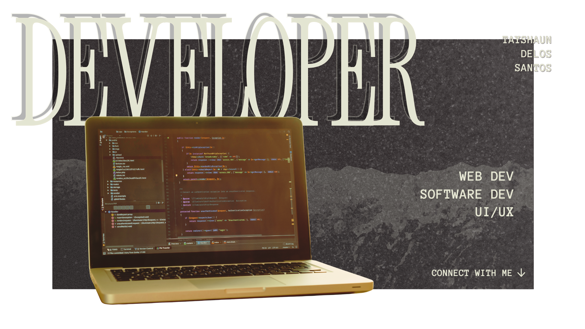

  &nbsp;&nbsp;
  

 

**Hi, I'm Tayshaun 👋** 

🚀 Full-stack developer leaning towards front-end and UI/UX 
⚙️ Specializes in Web and Software Development 
🎨 Loves creating design systems and wireframing/prototyping on Figma 
🏫 Studies Computer Science at Mapúa University in the Philippines 

  
🧑 More about me

   
  

    I love the process and learning that comes with being a developer. I am always looking for ways to challenge and improve on my current workflows and design processes. Despite having experience with full-stack project development and management of back-end services like MySQL and MongoDB, I favor Front-end development and UI/UX design due to the creative nature that comes with it. I am always enthusiastic when it comes to new projects because of the process. The gathering of inspiration, creation of design systems, wireframing, and the implementation of the design and transformation to code are all satisfying to do.
  

  

    Outside of my workflow, I am a linux user that loves using open source tools and learning all things technology. Whether these are fiddling with terminal tools, ricing my system, or learning about the latest peripherals and accessories, I am a big nerd for computers and everything that comes with it.
  

# 💻 Languages and Tools

**Programming** 

**Design** 

**Database** 

# 📊 GitHub Stats
|  |  |  |
| --- | --- | --- |

